# Butterknife
Total time spent: 56
## Day 1 (16/6/25 
Today I mainly just did research into how a laser cutter works, different mechanisms etc. Currently my idea is to just make a core XY, like the gantry of the printer that I designed a few months ago. I think tha tI will eaither go with 10 or 20 watts. And an enclosure is absolutely madatory. I got some plywood, and I am probably going to make the frame out of that.
""Total Time spent: 5 hours**

## Day 2 (17/6/25)
Today I started to work on the CAD of my laser cutter, did some research into potential parts, and desided that I am goign to use 20 Watts for my laser cutter. That takes up almost a forth of the budget, I think that I might be able to find a coupon or something. Also believe it or not I think that I will actually be done with the CAD tomorrow, so lets hope that I can get this approved relatively quick
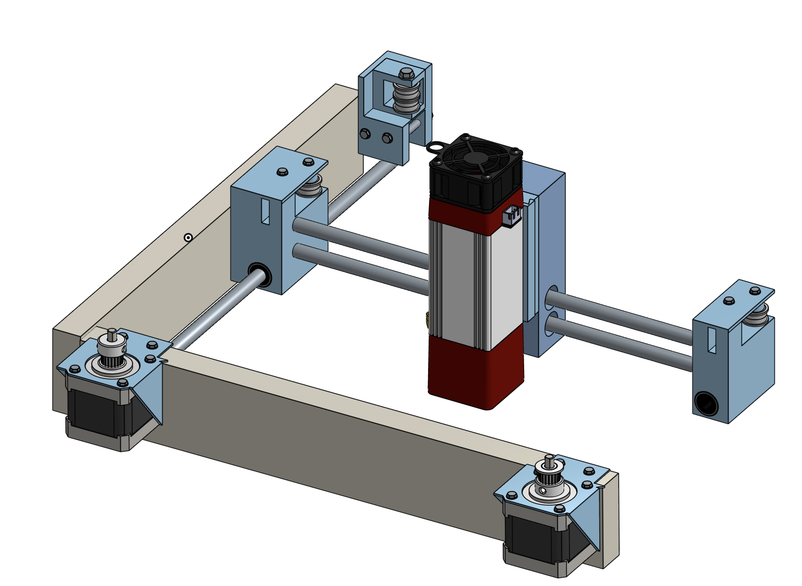
""Total Time spent: 4 and a half hours**
## Day 3 (18/6/25)
Today I actually spent a lot of time recearching again, and I realized that lasers are actually a lot mor eexpensive than I thought. The "20" Watt laser that I was looking at actually only have 20 watts of input power, and the optical power was closer to 5 Watts. I am going to have to search more, because most of the cheaper lasers taht I was looking at do the same thing, so the laser might end up being one of the more expensive parts on this. On the other hand, I got some wood for the fram, and I finished up most of the CAD for the butterknife itself, but I still have the laser toolhead left, and outer encolosure. TOday it might not look like I did a lot, but a ton of research, parts finding, and just general replanning happened today.
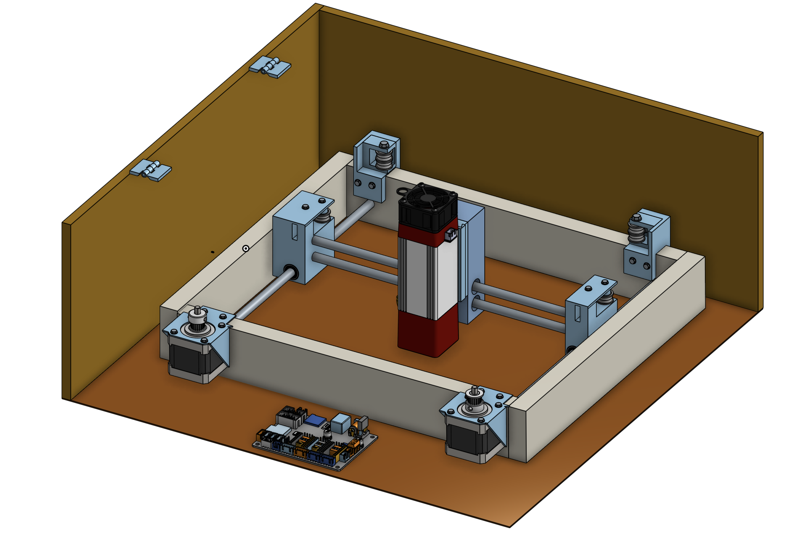
""Total Time spent: 4 and a half hours**

## Day 4 (19/6/25)
Today I added my laser, the mount from the laser to the linear bearings, and I started making the enclosure. I completely overestimated how fast I could CAD, however I actually finished the entire curring setup, and now I just need to make the top of the laser case, and then I will be able to start with the PCB. I mounted both of the motors, and assembled pretty much everything. I want to make this a  reallly high quality project, so I will probably make the CAD as good as I can. I also want to make a PCB for a control screen, so that might also show effort.

""Total Time spent: 3 and a half hours**
## Day 5 (20/6/25)
Today I think that I finished the CAD of the laser cutter, and that I will be able to finish the COM tomorrow. I made the outer enclosure, and I might add a littl ebit more for airflow and other electronics like fans and a control board, however I think tha tI will be able to get this over with pretty soon, even though I am pretty sure that I said this in literally other journal entry. On the bright side most of the parts for my filament recyclen have already arrived so that I can submit this pretty soon. I also feel like the CAD could be a little bit more clean with tht ecoloring, however I want to ship this before THursday, so that I at least have a chance at those headphones.
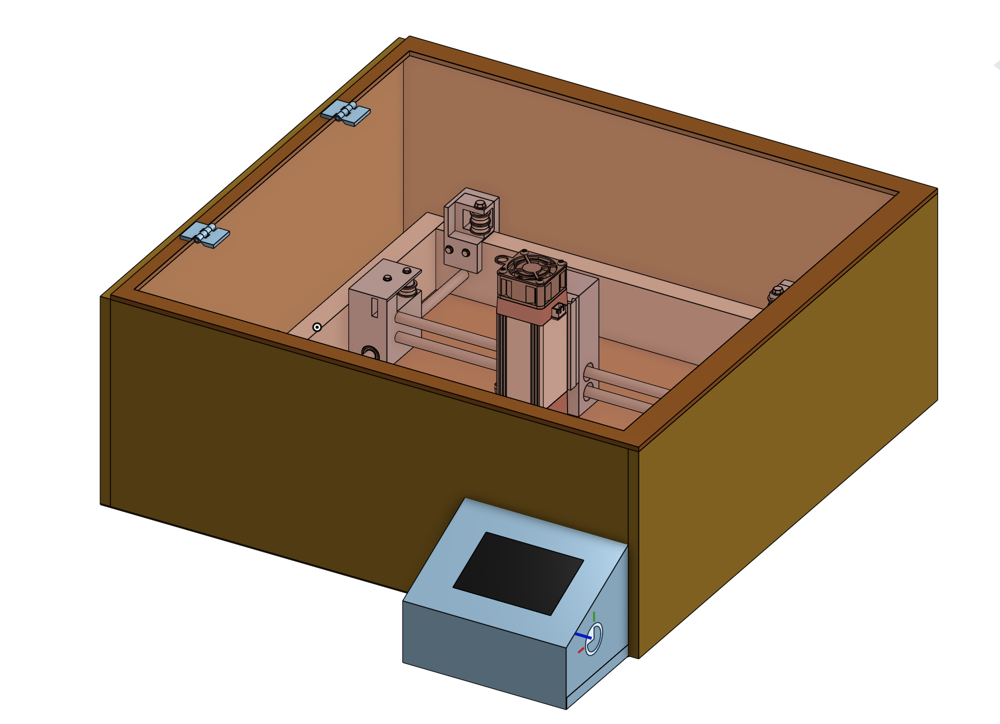

**Total Time: 4 and a half hours**
## Day 6 (28/6/25)
Today was the first part of researnching and making the BOM. I got some of the parts that I need, but I mainly just spen my time searching for a laser. I decided on a 10 watt one, and I was able to get if for 140 dollars, with some other stuff that I will need along with the laser.
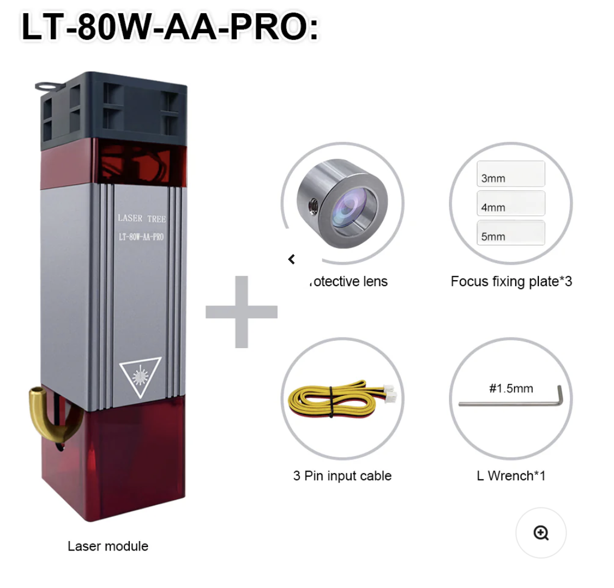
**Total time spent: 3 and a half hours**

## Day 7 (29/6/25)
Today I am ready to submit my project, and finished my BOM. today I got everything done for the BOM, and i also finished the readME. I also postied everything in highway pitstop, and did more reasearch for my BOM. The total ended up costing 323 dollars which was more than I would have liked, but it still fits inside the budget.
** Total time spend: 5 and a hald hours**
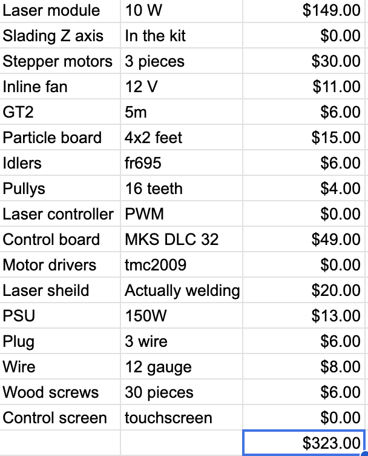

## Day 8 (25/6/26)
After almost a year, I finally got around to building it. I had vacation from school today, so I dedicated the entire day to get this working. First, I worked on the electronic wiring while the printer was working on parts. I got the screen working and I was able to control the lasesrr over the web, on the default firmware. Afterwards, I assembled the gantry while other parts were printing. Although the X axis was a little rough, it lossened up a I secured it to the frame. I drilled out the mounts for the linear rods with a 8mm drill bit. After securing the gantry in the outer frame, I was able to move it pretty smoothlly, after adding on the belt, I realized that it wasn't llong enough as I was reusing from another projecct, so I psent a long time trying too extend it. I decided to try again tomorrow and actually get it done, because I literally spent the entire day on this.

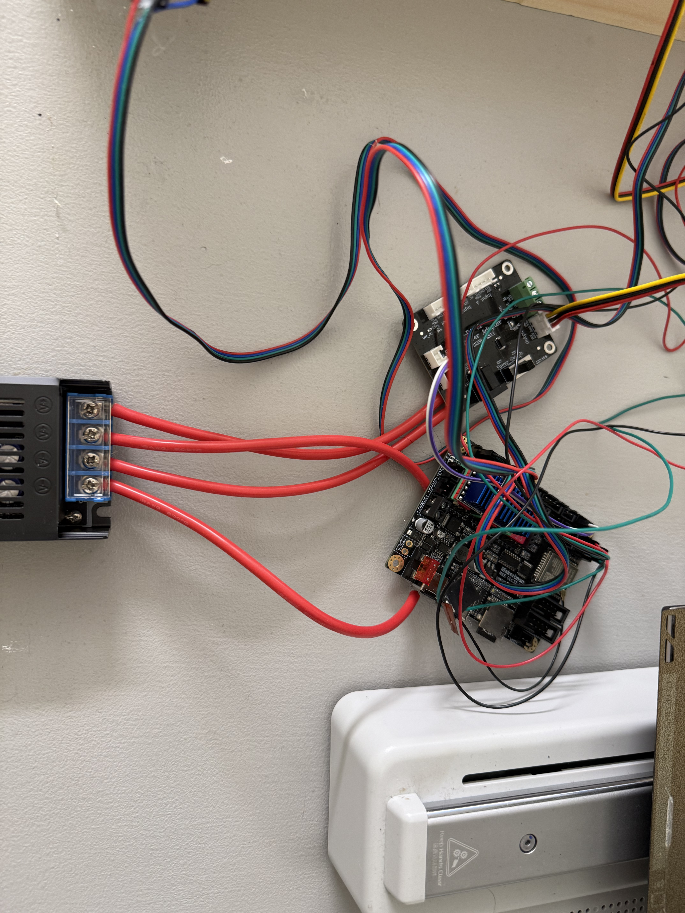
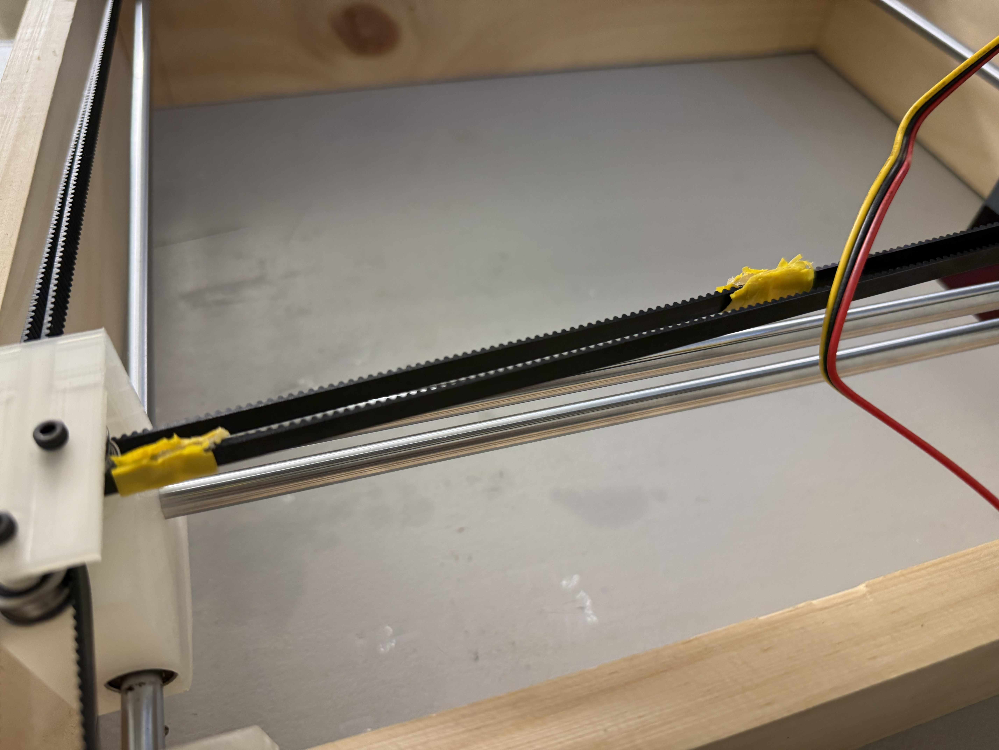

**Total time spent: 12 hours**

## Day 9 (26/6/26)
Today I was determined to finish the project, so I spent another day grinding. I added the limit switches and built the outer case. That was actually pretty fast. Then I worked on the firmware. I spent a long time trying to get fluidNC to work with the TFT that I got, but ultimately I was not able to, and actually installing fluidNC took a lot longer than I thought. However, I was able to get it on the wifi, and then I had to assign all of the pins and settings. After a bunch of troubleshooting, I finally got all of the controls to work. However, for some reason it wasn't working on chrome, so instead I had to access the port over safari or firefox. Afterwards, I also realized that I had to change the Gcode generator that I was using, as LaaerGRBL didn't work on Mac, so instead I had to use rayforge. For a while I was having a ton of softwarae and slicing issues. But when I finally got the got it moving, my bellt ssnapped, so I had to reattach and melt them together. I finally was able to try engraving, however it ended up pretty bandy, so that was something that I am going to fix to fix tomorrow, but for now I'm just happy it is recognizable.

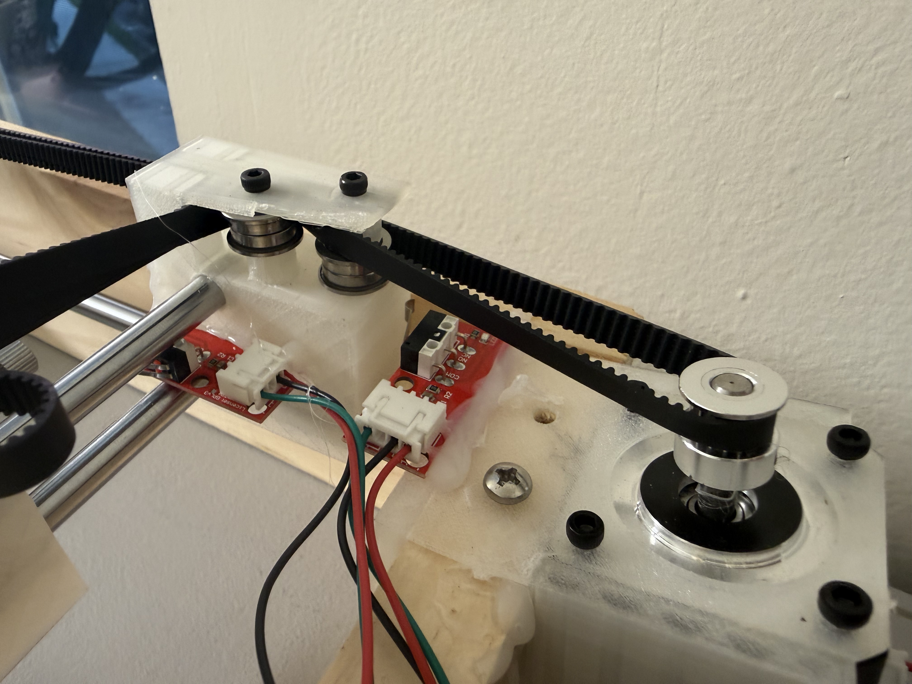
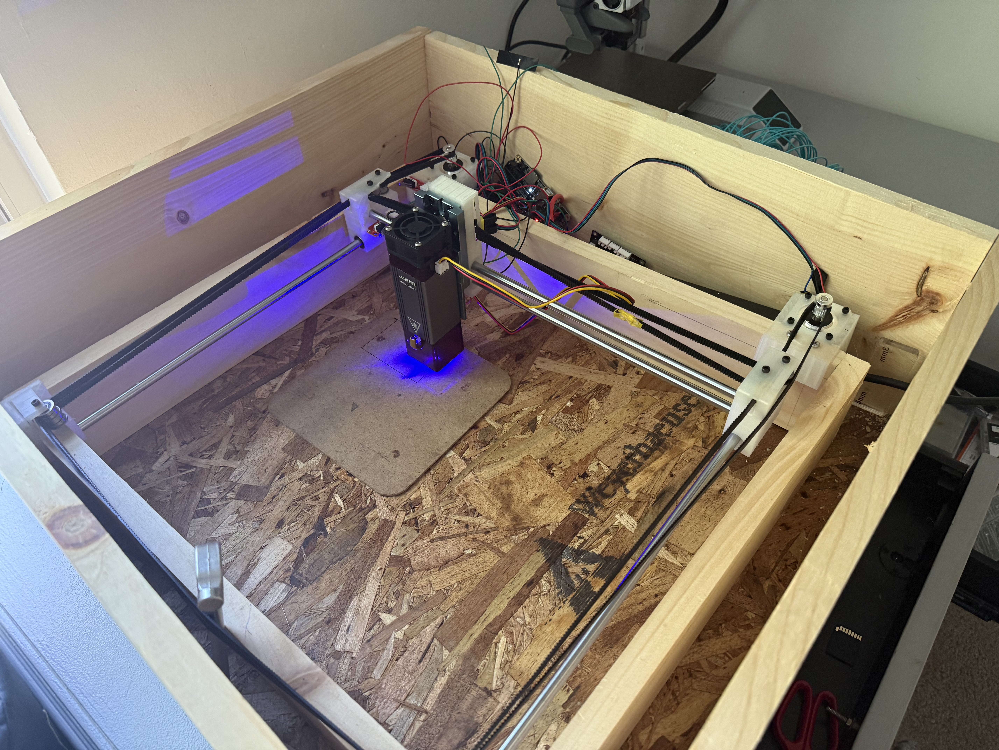

**Total Time spent 10 and a half hours**

## Day 10 (28/6/26)
After a break, I'm back on the frinid. I realiized that there wass a problen with the caridgess, and so I redesigned and reprinted them, and now it seems like they move smoother. i also changed the toolhend so that there isn't as much of a incline towards the toolhead. Other than that I only changed a few of the parts of firmware aboout speed and I did some calibrating for the speed and power on different aterials. I got a clean engraving, and even cut a kit card out of cardboard. Honestly, I felt like this was a success.
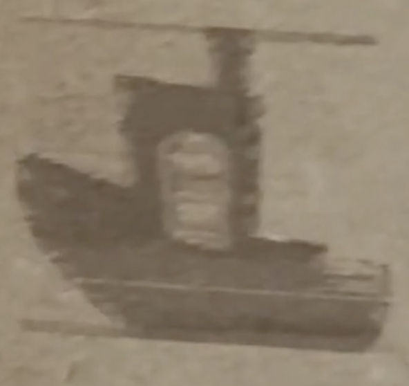
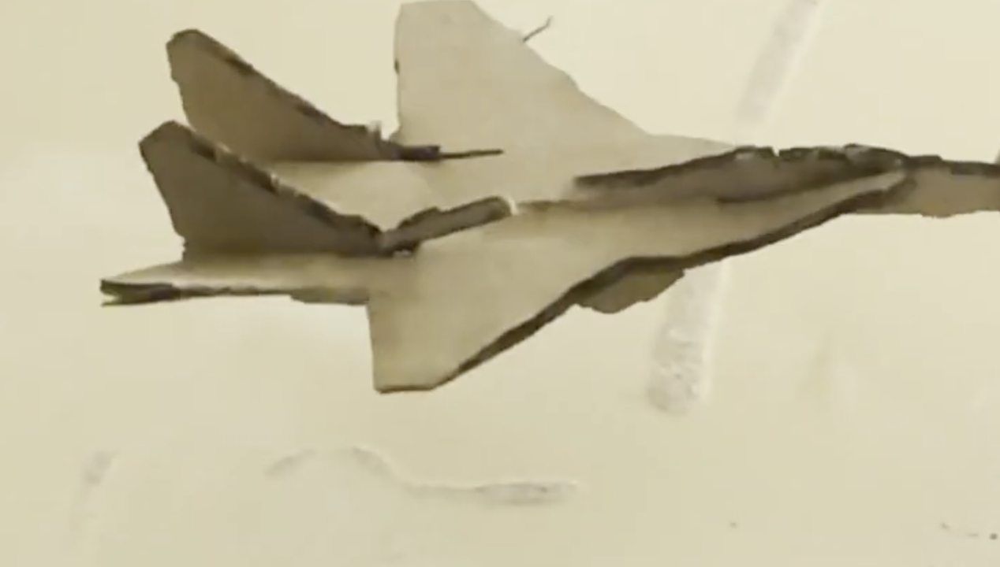

**Total time spent: 2 and a half hours.**

